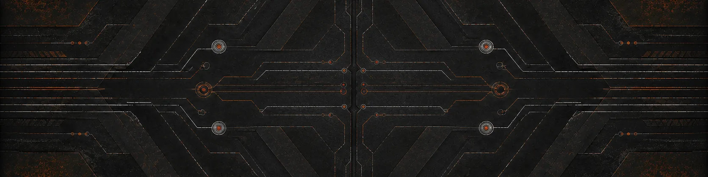

My research is in visual saliency and attention, with a focus on how
perception differs across populations that datasets tend to leave out,
including people with traumatic brain injury and people who are blind or
have low vision. Much of what I build for it is research infrastructure:
tools for annotation, dataset engineering, benchmarking, and figures,
designed so results stay reproducible and auditable years later.

Alongside it I'm learning to develop secure, safety-critical systems,
built to be verified rather than tested. That work is mostly in Rust,
moving from sanitizers and fuzzing toward model checking and
machine-checked proofs. I'm also getting into offensive security and
defensive programming, looking at how memory-safety bugs turn into
exploits and how to design code that rules them out.

Learned components are steadily entering these systems, and the models,
the low-level systems they run on, and the assurance that they behave
correctly are usually held by different people. I want to be an engineer
who can be trusted with all three.

## Philosophy

With systems, I'm drawn to ownership, type-level invariants, allocator
discipline, and compile-time composition. With functional, I'm drawn to
effect tracking, algebraic data types, and totality checking. With
verification, I'm drawn to machine-checked specifications, model checking,
and proofs that hold for all inputs. Some of these I work in, some I'm
learning my way into. All of them shape how I think about building software.

<table>
<thead>
<tr><th align="left">Systems</th><th align="left">Security</th><th align="left">Functional</th><th align="left">Verification</th><th align="left">Research</th><th align="left">GPU</th></tr>
</thead>
<tbody>
<tr valign="top">
<td>Rust Zig C C++ Ada</td>
<td>x86-64 asm ARM64 asm</td>
<td>Haskell Scala Elixir Nix</td>
<td>Lean 4 Verus TLA+</td>
<td>Python Swift LaTeX</td>
<td>CUDA Vulkan GLSL</td>
</tr>
</tbody>
</table>

## Publications

- **Salient Object Detection for Images Taken by People with Vision Impairments.** WACV 2024, first author. [paper](https://openaccess.thecvf.com/content/WACV2024/papers/Reynolds_Salient_Object_Detection_for_Images_Taken_by_People_With_Vision_WACV_2024_paper.pdf)
- SPIN: Hierarchical Segmentation with Subpart Granularity in Natural Images. ECCV 2024. [paper](https://arxiv.org/pdf/2407.09686)
- Interpreting COVID Lateral Flow Tests' Results with Foundation Models. CVPR Workshops 2024. [paper](https://openaccess.thecvf.com/content/CVPR2024W/DEF-AI-MIA/papers/Pandey_Interpreting_COVID_Lateral_Flow_Tests_Results_with_Foundation_Models_CVPRW_2024_paper.pdf)
- Hierarchical Instance Tracking to Balance Privacy Preservation with Accessible Information. WACV 2026. [paper](https://openaccess.thecvf.com/content/WACV2026/papers/Prasad_Hierarchical_Instance_Tracking_to_Balance_Privacy_Preservation_with_Accessible_Information_WACV_2026_paper.pdf)

[Website](https://no-unwrap.github.io) · [Google Scholar](https://scholar.google.com/citations?user=BypC2fgAAAAJ&hl=en) · [LinkedIn](https://www.linkedin.com/in/no-unwrap/) · [YouTube](https://www.youtube.com/@no-unwrap) · [Instagram](https://www.instagram.com/no.unwrap)
